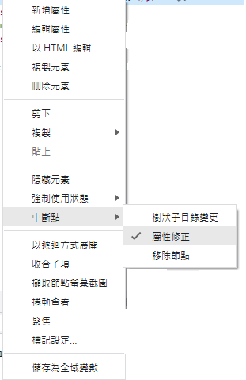
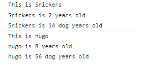
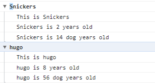
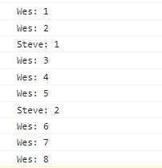

# 09 - Dev Tools Domination

## 摘要

介紹 chrome 的開發工具，各種 console.的用法

## 內容

### DOM BREAK ON

介紹了 DOM 的中斷點模式，分別有三種觸發模式可選（可複選）

1. subtree modifications: 當子元素點發生變化時
2. arrtibute modifications: 當元素發生變化時
3. node removal: 當元素被移除時

    

### 1. Regular - 使用一班的方法印出常數

```javascript =
console.log('hellow');

// hellow
```

### 2. Interpolated - 能夠將特定內容帶到 %s 裡面

```javascript =
console.log('Hello I am a %s string!', '+po');

// Hello I am a +po string!
```

### 3. Styled - 能夠像 html 中印出 style 的屬性

```javascript =
console.log('%c I am some great text', 'font-size:20px ;background:red;');

// I am some great text 帶有 20px 的字體大小 與 紅色背景
```

### 4. warning, Error, Info - 一些警告提示標語

```javascript =
console.warn('OH NOOOO'); // 黃色三角驚嘆號
console.error('Shit'); // 紅色叉叉
console.info('this is info'); // 藍色驚嘆號
```

### 5. Testing - 會判斷 console 裡面的內容是否為 true or false ，如果為 falese 則會提示出後面給定的提示標語

```javascript =
console.assert(1 === 1, 'That is wrong'); // 什麼都沒顯示
const p = document.querySelector('p');
console.assert(p.classList.contains('ouch'), 'p 並沒有包含ouch這個class 這個名稱喔');
// 顯示出 p 並沒有包含ouch這個class 這個名稱喔
補充;
console.assert(true, '訊息');
console.assert(false, '前面訊息沒有通過，就會噴這段訊息');
console.assert('', '前面訊息沒有通過，就會噴這段訊息');
console.assert(0, '前面訊息沒有通過，就會噴這段訊息');
console.assert(NaN, '前面訊息沒有通過，就會噴這段訊息');
console.assert(null, '前面訊息沒有通過，就會噴這段訊息');
console.assert(undefined, '前面訊息沒有通過，就會噴這段訊息');
```

### 6. clearing - 清除以上所有的 log 訊息

```javascript =
console.clear();
```

### 7. Viewing DOM Elements (dir) - 可以看到標籤內的所有 element

```javascript =
const p = document.querySelector('p');
console.log(p); // <p onClick="makeGreen()">×BREAK×DOWN×</p>
console.dir(p); // 縣市裡面各種 p 標籤的屬性
```

### 8. Grouping together - 搭配 forEach 的話可以幫我們群組內容

```javascript =
一般情況下我們會看到的內容為;
dogs.forEach((dog) => {
	console.log(`This is ${dog.name}`);
	console.log(`${dog.name} is ${dog.age} years old`);
	console.log(`${dog.name} is ${dog.age * 7} dog years old`);
});
```



```javascript =
使用group or groupCollapsed 則會呈現
dogs.forEach((dog) => {
	console.groupCollapsed(`${dog.name}`);
	console.log(`This is ${dog.name}`);
	console.log(`${dog.name} is ${dog.age} years old`);
	console.log(`${dog.name} is ${dog.age * 7} dog years old`);
	console.groupEnd(`${dog.name}`);
});
```



### 9. couting - 計算有幾個

```javascript =
console.count('Wes');
console.count('Wes');
console.count('Steve');
console.count('Wes');
console.count('Wes');
console.count('Wes');
console.count('Steve');
console.count('Wes');
console.count('Wes');
console.count('Wes');
```



### 10. timing - 可以計算 console.time('')到 console.timeEnd('')的執行時間。

```javascript =
console.time('fetching data');
fetch('https://ithelp.ithome.com.tw/articles/10302628')
	.then((data) => data.type)
	.then((data) => {
		console.timeEnd('fetching data');
	});

// fetching data: 331.2109375 ms
```
